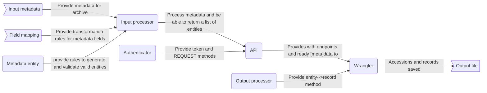

[](https://github.com/astral-sh/ruff) [](https://pypi.org/project/biobroker/) [](https://biobroker.readthedocs.io/en/latest/?badge=latest)
[](https://pydantic.dev)


# Biobroker

This repository contains the source code for the `Biobroker` python package. This package contains
multiple utilities, but the overall philosophy/goal can be described in a phrase:


>Given an input file of any type containing metadata about entities, broker it to any archive
> and return a human-readable result.

I understand that this is a very ambitious project; for starters, the variety of existing archives
is way too high. For now, this package is being developed by extending my knowledge on the european
genomics/bio archives hosted by EMBL-EBI. It may be that some archives can't just be adapted, but I
will be very happy if this library can be extended to just work with enough archives to ensure a biology
laboratory can set up an automatic brokering process that works for them.

## Infrastructure summary

The infrastructure, in simple terms, is a very modularized submission system. Each of the components
should have a generic python object, that collects all the attributes and expected methods for
that class. Then, for each archive, a set of subclasses for each (Or some) of those modules must be
defined.

Let's take as an example the "authenticator". Very briefly, authenticator is a module that takes in
a password and a username and spits out a token. It also defines the requests, to ensure the token is
always provided with the headers.

Each subclass of the `GenericAuthenticator` defines:
- What is the base_uri of the authentication service
- What is the auth endpoint called to retrieve the token
- What is the process to retrieve the token (Sometimes, like in the `WebinApi`, requests need to have a
specific body)

And so on with all the modules.

All these modules interact with each other, but can be used mostly independently. Some modules are dependent
on each other, such as the API module needing the Authenticator in order to send requests. In the end, there
is a module that loads all of them, but should be generic enough that only one needs to be defined: the `Wrangler`.

A graphical representation of the overall infrastructure can be seen below:



Examples can be found under the `examples` folder. <span style="color:red">**WIP**</span>

Further documentation, including extended definitions and restrictions/requirements for all classes will
be given below; for code-generated documentation, please refer to the docs.

## How-to

### Install

```shell
pip3 install biobroker
```

### Run

This library does not support CLI access at the moment (Maybe in the future I could think of a CLI; although I would
much rather have a simple GUI). As such, you will have to install and write scripts using the objects

Please see the [examples](https://github.com/ESapenaVentura/biobroker/examples) folder.

#### Environment variables

- `BROKER_LOG`: Path to store the log for the execution of the library. Defaults to `broker_log.txt` if not set.
- `API_ENVIRONMENT`: Environment to be used by the API/Auth service.

### Generate documentation

To generate documentation:

1. Go to the root of the repository: `cd biobroker`
2. `cd docs`
3. `make clean html`

This is usually not needed, as there is a GH action set-up to generate the documentation automatically. Use it only if
you're not experienced with sphinx/unsure of how changes will look like in the RTD docs.

#### Adding a new class

If you add a new subclass, please add it under the `autosummary` directive in the RST file. You can see the examples
in the existing `docs/` folder.

If you add a new pydantic model for metadata validation, please include it in `docs/biobroker.generic.rst` under the
first automodule directive.

#### Re-creating RST files from scratch

If the RST files need to be regenerated, it can be done as so:

```commandline
sphinx-apidoc -Mf -o docs biobroker
```

This will regenerate the rst files with module content first! Just as I like it. However, we almost never want to
regenerate the RST files - So please don't do this without opening an issue and a related PR.

## Notes for developers
Regarding documentation:

- When adding <span style="color:red">development notes</span> that are specific to a submodule, please add them under "README.md" within the
  submodule folder.

- When adding <span style="color:red">user guidelines</span> or user-friendly descriptions for any of the submodules, please fill out the
  `__init__` file within the submodule folder. User-friendly documentation for the library is generated from
  this file (For top/high-level module documentation) and from the code itself (for command/function documentation)
  using [`Sphinx`](https://www.sphinx-doc.org/en/master/)

Regarding new entities:
- Read the `Generic` of each subclass you want to create. You will need to override some functions and properties!
- I don't know if this is the best practice, but I have a rule of thumb for making new functions:
    - If it's used by external entities (e.g. `api` object accessing a `metadata_entity` method), don't make it private
    - If it's just used by the entity internally (e.g. `metadata_entity` calling a function to process certain data), make
      it private.
- Add the new subclass under the '__init__.py' document, both in `__all__` and as an import
- For pre-submission validation, please use pydantic models. You can easily generate valid pydantic models from schemas,
  if they are available. I use pydantic models for slight data corrections as well (e.g. date parsing/formatting)

