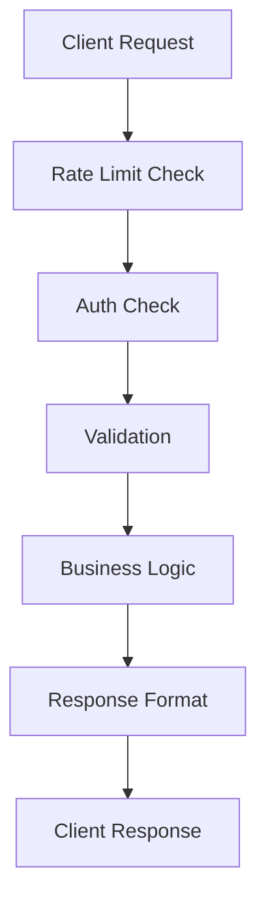

# Architecture Overview

This document describes the core architecture of the Flask API Boilerplate, explaining how different components work together to provide a robust, scalable API framework with AI capabilities.

## Directory Structure

```
src/flask_structured_api/
├── api/ # API endpoints
│ ├── core/ # Core API functionality
│ └── custom/ # Custom API extensions
├── core/ # Core framework components
│ ├── ai/ # AI integration
│ ├── auth/ # Authentication
│ ├── cache/ # Caching
│ ├── config/ # Configuration
│ ├── db/ # Database
│ ├── handlers/ # Error handlers
│ ├── middleware/ # Middleware
│ ├── models/ # Data models
│ ├── services/ # Business logic
│ └── utils/ # Utilities
├── custom/ # Custom extensions
│ ├── models/ # Custom models
│ ├── services/ # Custom services
│ └── utils/ # Custom utilities
├── extensions/ # Flask extensions
└── main.py # Application entry
```

## Core Concepts

### Model-First Design

We follow a model-first approach using SQLModel, which combines SQLAlchemy's ORM capabilities with Pydantic's validation:

```python
from sqlmodel import SQLModel, Field
from datetime import datetime

class CoreModel(SQLModel):
    """Base model for all database models"""
    id: int = Field(default=None, primary_key=True)
    created_at: datetime = Field(default_factory=datetime.utcnow)
    updated_at: datetime = Field(default_factory=datetime.utcnow)

class User(CoreModel, table=True):
    """Example of a model implementation"""
    email: str = Field(unique=True, index=True)
    hashed_password: str
    is_active: bool = Field(default=True)
```

## Core Components

### Database Structure

We use PostgreSQL with SQLModel for:

-   Type-safe database operations
-   Automatic schema validation
-   Migration management (Alembic)
-   Relationship handling

Key concepts:

```python
# Models are defined in app/models/
# Database setup in app/core/db.py
# Migrations in migrations/
```

### Caching

Redis-based caching system with:

-   Response caching
-   Rate limiting
-   Session storage
-   Background task queues

Configuration:

```python
# app/core/cache.py
class CacheManager:
    def __init__(self):
        self.redis = Redis.from_url(settings.REDIS_URL)
        self.default_ttl = 3600  # 1 hour

    async def get_or_set(self, key: str, func, ttl: int = None):
        """Get from cache or compute and store"""
        if value := await self.get(key):
            return value
        value = await func()
        await self.set(key, value, ttl)
        return value
```

### Background Tasks

Celery-based task processing system:

-   Async task execution
-   Task scheduling
-   Retry policies
-   Dead letter queues

Configuration:

```python
# app/core/tasks.py
class TaskManager:
    def __init__(self):
        self.celery = Celery('app', broker=settings.REDIS_URL)
        self.default_retry_limit = 3

    def create_task(self, func, retry_limit: int = None):
        """Create a new background task"""
        @self.celery.task(bind=True, max_retries=retry_limit or self.default_retry_limit)
        def wrapped_task(self, *args, **kwargs):
            try:
                return func(*args, **kwargs)
            except Exception as e:
                self.retry(exc=e)
        return wrapped_task
```

### Warning Collection

Centralized warning accumulation system:

-   Warning levels (INFO, WARN, ERROR)
-   Context preservation
-   Aggregation support
-   Audit trail

Implementation:

```python
# app/core/warnings.py
class WarningCollector:
    def __init__(self):
        self.warnings = []
        self.context = {}

    def add_warning(self, message: str, level: str = "WARN", context: dict = None):
        """Add a new warning with context"""
        warning = {
            "message": message,
            "level": level,
            "timestamp": datetime.utcnow(),
            "context": {**self.context, **(context or {})}
        }
        self.warnings.append(warning)
```

### Rate Limiting

Configurable rate limiting using Redis:

-   Global and per-endpoint limits
-   Burst handling
-   Custom rate limit rules

Example configuration:

```python
# app/core/config.py
RATE_LIMIT_ENABLED = True
RATE_LIMIT_DEFAULT = 60  # requests per minute
RATE_LIMIT_WINDOW = 3600  # time window in seconds
```

### Authentication & Authorization

JWT-based authentication system:

-   Token-based authentication
-   Role-based access control
-   Session management
-   Token refresh mechanism

Implementation:

```python
# app/core/auth.py
@require_auth
@require_roles(['admin'])
def protected_route():
    """Only accessible by admins"""
    pass
```

### API Versioning

URL-based versioning strategy:

-   Semantic versioning (MAJOR.MINOR)
-   Version lifecycle management
-   Deprecation policies
-   Migration tooling

Example implementation:

```python
# app/core/versioning.py
class VersionManager:
    def __init__(self):
        self.current_version = "2.0"
        self.supported_versions = ["1.0", "2.0"]
        self.deprecated_versions = ["1.0"]

    def is_supported(self, version: str) -> bool:
        return version in self.supported_versions

    def is_deprecated(self, version: str) -> bool:
        return version in self.deprecated_versions
```

## AI Service Integration

Modular AI service integration supporting multiple providers:

-   Provider-agnostic interface
-   Response validation
-   Error handling
-   Request/response logging

```python
# app/core/ai/base.py
class AIProvider(Protocol):
    """Base protocol for AI providers"""
    async def generate(self, prompt: str, **kwargs) -> str:
        """Generate text using AI model"""
        ...

# app/core/ai/providers/openai.py
class OpenAIProvider(AIProvider):
    """OpenAI implementation"""
    def __init__(self):
        self.client = OpenAI(api_key=settings.AI_API_KEY)
```

## Security Model

### Request Validation

All requests are validated using Pydantic models:

```python
# app/models/requests/user.py
class UserCreateRequest(BaseModel):
    email: EmailStr
    password: str = Field(min_length=8)
    full_name: str
```

### Response Format

Standardized response format:

```python
# app/core/responses.py
class APIResponse(BaseModel):
    success: bool
    message: Optional[str] = None
    data: Optional[Dict] = None
    warnings: List[str] = []
```

### Error Handling

Centralized error handling:

```python
# app/core/exceptions.py
class APIError(Exception):
    def __init__(self, message: str, code: str = None, status: int = 400):
        self.message = message
        self.code = code
        self.status = status
```

You're right - more descriptive error codes are better practice. Here's an updated version of the error handling section for the architecture README:

````markdown:docs/architecture/README.md
### Error Handling

We use semantic error codes that combine a domain prefix with a descriptive error type:

```python
# app/core/exceptions.py
class APIError(Exception):
    """Base API error class"""
    def __init__(
        self,
        message: str,
        code: str = None,
        status: int = 400,
        details: dict = None
    ):
        self.message = message
        self.code = code
        self.status = status
        self.details = details or {}
````

### Example error codes and their meanings:

```python
ERROR_CODES = {
    # Authentication errors (AUTH_*)
    'AUTH_INVALID_CREDENTIALS': 'Invalid username or password provided',
    'AUTH_TOKEN_EXPIRED': 'Authentication token has expired',
    'AUTH_TOKEN_INVALID': 'Invalid authentication token',
    'AUTH_INSUFFICIENT_PERMISSIONS': 'User lacks required permissions',

    # Validation errors (VAL_*)
    'VAL_MISSING_FIELD': 'Required field is missing',
    'VAL_INVALID_FORMAT': 'Field format is invalid',
    'VAL_CONSTRAINT_VIOLATION': 'Field value violates constraints',

    # Resource errors (RES_*)
    'RES_NOT_FOUND': 'Requested resource not found',
    'RES_ALREADY_EXISTS': 'Resource already exists',
    'RES_CONFLICT': 'Resource state conflict',

    # AI Service errors (AI_*)
    'AI_PROVIDER_ERROR': 'AI provider returned an error',
    'AI_INVALID_RESPONSE': 'AI response failed validation',
    'AI_CONTENT_POLICY': 'Content policy violation',
    'AI_TOKEN_LIMIT': 'Token limit exceeded',

    # Rate limiting errors (RATE_*)
    'RATE_LIMIT_EXCEEDED': 'Rate limit exceeded for this endpoint',
    'RATE_INVALID_CONFIG': 'Invalid rate limit configuration',

    # Database errors (DB_*)
    'DB_CONNECTION_ERROR': 'Database connection failed',
    'DB_CONSTRAINT_ERROR': 'Database constraint violation',
    'DB_TRANSACTION_ERROR': 'Transaction failed',

    # System errors (SYS_*)
    'SYS_INTERNAL_ERROR': 'Internal server error',
    'SYS_SERVICE_UNAVAILABLE': 'Service temporarily unavailable',
    'SYS_INVALID_CONFIG': 'Invalid system configuration'
}
```

Example error response:

```
{
    "success": false,
    "message": "Validation failed for RegisterRequest",
    "error": {
        "code": "VALIDATION_ERROR",
        "errors": [
            {
                "field": "password",
                "message": "Field required",
                "type": "value_error.missing"
            }
        ],
        "required_fields": ["password"],
        "details": {
            "total_errors": 1,
            "schema": "RegisterRequest",
            "validation_context": "request_payload"
        }
    },
    "data": null,
    "warnings": []
}
```

Benefits of this approach:

-   Self-documenting error codes
-   Domain-specific error grouping
-   Consistent error handling
-   Detailed error context
-   Easy error tracking and analytics

## Request Flow

1. Request received by Flask
2. Rate limiting check
3. Authentication/Authorization
4. Request validation
5. Business logic execution
6. Response formatting
7. Response sent to client



## Scaling Considerations

The architecture supports horizontal scaling through:

-   Stateless application design
-   Redis for shared state
-   Database connection pooling
-   Docker containerization

## Next Steps

-   [API Documentation](../api/README.md)
-   [Development Guide](../development/README.md)
-   [Deployment Guide](../deployment/README.md)

## Related Resources

-   [SQLModel Documentation](https://sqlmodel.tiangolo.com/)
-   [Flask Documentation](https://flask.palletsprojects.com/)
-   [Redis Documentation](https://redis.io/docs/)
