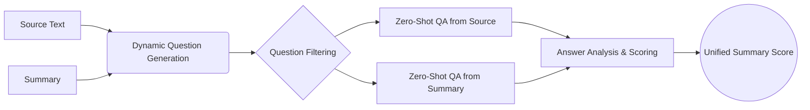

# Enhanced Holistic Summary Evaluation System with Zero-Shot LLaMA

Great initiative on building a robust summary evaluation system using LLaMA 3 8B! Below is an enhanced version of your proposed architecture, incorporating improvements in prompt generation, dynamic question algorithms, answer analysis & scoring, efficiency, consistency, and reliability. This comprehensive approach aims to make your system the most robust summary evaluation tool available.

## 1. System Architecture



**Improvements:**

* **Parallel Processing:** Parallelize the Zero-Shot QA processes to enhance efficiency.
* **Feedback Loop:** Introduce a feedback mechanism from Answer Analysis to Dynamic Question Generation for iterative improvement.
* **Caching Mechanism:** Implement caching for repeated computations to enhance efficiency and ensure consistency.
* **Deterministic Components:** Integrate rule-based checks alongside ML-based components to ensure consistent outputs.

## 2. Components & Methodology

### (A) Source Text

* **Definition:** The original, full-length text that the summary is intended to represent.
* **Enhancements:**
  - **Preprocessing Pipeline:** Standardize preprocessing steps (e.g., tokenization, normalization) to ensure consistent input for all components.
  - **Section Segmentation:** Divide the source text into sections or paragraphs to facilitate targeted question generation.

### (C) Summary

* **Definition:** The generated summary to be evaluated.
* **Enhancements:**
  - **Format Validation:** Ensure the summary adheres to expected formats (e.g., length constraints, absence of specific keywords).
  - **Standardization:** Apply consistent formatting (e.g., sentence casing) to aid in comparative analysis.

### (B) Dynamic Question Generation (LLaMA 3 8B)

**Enhancements:**

* **Hybrid Prompting Strategy:**
  - **ML-Based:** Utilize LLaMA for generating diverse and context-aware questions.
  - **Rule-Based Augmentation:** Supplement ML-generated questions with predefined, high-importance questions to ensure critical aspects are always evaluated.
* **Contextual Awareness:**
  - **Sequential Questioning:** Generate questions in a context-aware manner, ensuring logical progression and coverage.

#### Enhanced Prompt Templates:

**Information Coverage:**

```
"Given this summary: [summary text] and this source document: [source text], generate questions that assess whether the summary includes all critical information from the source."
```

**Logical Consistency:**

```
"Create questions that evaluate the logical flow and coherence of the summary compared to the source: [summary text] vs [source text]."
```

**Relevance:**

```
"Generate questions to determine if the summary includes only relevant information and excludes unnecessary details from the source: [summary text] vs [source text]."
```

**Clarity and Conciseness:**

```
"Formulate questions that assess the clarity and conciseness of the summary: [summary text]."
```

#### Dynamic Number of Questions: Enhanced Algorithm

**File Path:** `src/question_generation/dynamic_questions.py`

```python:path/src/question_generation/dynamic_questions.py
def determine_num_questions(source_length, summary_length):
    """
    Determine the number of questions based on the lengths of the source and summary texts.
    
    Args:
        source_length (int): Length of the source text.
        summary_length (int): Length of the summary text.
    
    Returns:
        int: Total number of questions to generate.
    """
    base_questions = 7  # Increased minimum for broader coverage
    length_ratio = source_length / summary_length
    scaling_factor = 3  # Adjusted scaling for finer control
    additional_questions = int(length_ratio * scaling_factor)
    total_questions = base_questions + additional_questions
    max_questions = 20  # Cap to prevent excessive question generation
    return min(total_questions, max_questions)
```

**Explanation:**

* **Increased Base Questions:** Ensures foundational coverage of evaluation aspects.
* **Adjusted Scaling Factor:** Provides finer control over the number of additional questions based on the length ratio.
* **Maximum Cap:** Prevents the generation of an excessive number of questions, optimizing computational resources.

### (D) Question Filtering

**Enhancements:**

* **Deterministic Filtering Rules:**
  - Implement rule-based filters to ensure questions meet minimum quality standards, reducing reliance on ML for basic checks.
  - **Examples:**
    - **Length Constraints:** Questions must be within a specified word count.
    - **No Duplicates:** Eliminate exact or near-duplicate questions.
    - **Grammaticality Check:** Ensure questions are grammatically correct using rule-based parsers.
* **ML-Assisted Semantic Filtering:**
  - Use LLaMA to assign relevance scores, supplementing deterministic rules.

**Techniques:**

* **Advanced Heuristics:** Implement NLP techniques to evaluate question quality beyond basic heuristics.
* **Relevance Scoring:** Utilize LLaMA to assign relevance scores and filter accordingly.

**File Path:** `src/question_filtering/filtering.py`

```python:path/src/question_filtering/filtering.py
import re

def deterministic_filters(question):
    """
    Apply deterministic rules to filter out low-quality questions.
    
    Args:
        question (str): The question to evaluate.
    
    Returns:
        bool: True if the question passes all filters, False otherwise.
    """
    # Length constraints
    if not (5 <= len(question.split()) <= 20):
        return False
    # No duplicates (handled externally)
    # Grammaticality check (basic regex for ending with a question mark)
    if not question.strip().endswith("?"):
        return False
    # No special characters or nonsensical patterns
    if re.search(r'[^\w\s\?]', question):
        return False
    return True

def semantic_relevance_filter(question, source_text, summary_text, model):
    """
    Use LLaMA to assess the semantic relevance of the question.
    
    Args:
        question (str): The question to evaluate.
        source_text (str): The source text.
        summary_text (str): The summary text.
        model: Pre-trained LLaMA model for scoring.
    
    Returns:
        bool: True if the question is relevant, False otherwise.
    """
    prompt = (
        f"Evaluate the relevance of the following question to the summary and source text.\n\n"
        f"Summary: {summary_text}\n"
        f"Source: {source_text}\n"
        f"Question: {question}\n\n"
        f"Is this question relevant and useful for evaluating the summary? Please answer with 'Yes' or 'No'."
    )
    response = model.generate_response(prompt)
    return response.strip().lower() == "yes"

def filter_questions(questions, source_text, summary_text, model):
    """
    Filter a list of questions based on deterministic and semantic rules.
    
    Args:
        questions (list of str): The list of generated questions.
        source_text (str): The source text.
        summary_text (str): The summary text.
        model: Pre-trained LLaMA model for semantic relevance.
    
    Returns:
        list of str: The filtered list of high-quality questions.
    """
    filtered = []
    seen = set()
    for q in questions:
        q_clean = q.strip()
        if q_clean.lower() in seen:
            continue
        if not deterministic_filters(q_clean):
            continue
        if not semantic_relevance_filter(q_clean, source_text, summary_text, model):
            continue
        filtered.append(q_clean)
        seen.add(q_clean.lower())
    return filtered
```

**Explanation:**

* **Deterministic Filters:** Ensure basic quality standards are met before invoking ML models, reducing computational load and increasing consistency.
* **Semantic Filtering:** Deploy LLaMA judiciously to validate the relevance, balancing between rule-based and ML-based approaches.

### (E) & (F) Zero-Shot QA from Source and Summary (LLaMA 3 8B)

**Enhancements:**

* **Consistency Mechanisms:**
  - **Fixed Prompts:** Use standardized prompt templates to ensure consistent outputs across evaluations.
  - **Temperature Control:** Set LLaMA's temperature parameter to a low value (e.g., 0) to promote deterministic responses.
* **Caching Answers:**
  - Implement caching for questions to avoid redundant computations when evaluating the same summary multiple times.

**File Path:** `src/qa/qa_system.py`

```python:path/src/qa/qa_system.py
from transformers import LlamaForCausalLM, LlamaTokenizer

class QASystem:
    def __init__(self, model_name='llama-3-8b', temperature=0.0):
        self.tokenizer = LlamaTokenizer.from_pretrained(model_name)
        self.model = LlamaForCausalLM.from_pretrained(model_name)
        self.temperature = temperature
        self.answer_cache = {}  # Cache to store previous answers
    
    def generate_answer(self, text, question):
        """
        Generate an answer to the question based on the provided text.
        
        Args:
            text (str): The source or summary text.
            question (str): The question to answer.
        
        Returns:
            str: The generated answer.
        """
        cache_key = (text, question)
        if cache_key in self.answer_cache:
            return self.answer_cache[cache_key]
        
        prompt = f"Based on the following text, answer the question:\n\nText: {text}\n\nQuestion: {question}\n\nAnswer:"
        inputs = self.tokenizer.encode(prompt, return_tensors='pt')
        outputs = self.model.generate(
            inputs,
            max_length=150,
            temperature=self.temperature,
            top_p=1.0,
            do_sample=False  # Deterministic generation
        )
        answer = self.tokenizer.decode(outputs[0], skip_special_tokens=True).split("Answer:")[-1].strip()
        self.answer_cache[cache_key] = answer
        return answer
```

**Explanation:**

* **Deterministic Generation:** By setting `temperature=0.0` and `do_sample=False`, LLaMA generates consistent answers for the same prompts.
* **Caching Mechanism:** Prevents redundant computations, enhancing efficiency and ensuring consistent results across evaluations.

### (G) Answer Analysis & Scoring (Robust with LLaMA Only)

**Enhancements:**

* **Deterministic Scoring Prompts:**
  - Design prompts to elicit structured and consistent scoring outputs.
  - **Format Enforcement:** Instruct LLaMA to respond with numerical scores only, avoiding variability in formats.
* **Structured Output Parsing:**
  - Implement strict parsing mechanisms to extract scores reliably from LLaMA's responses.

**File Path:** `src/answer_analysis/answer_analysis.py`

```python:path/src/answer_analysis/answer_analysis.py
from transformers import LlamaForCausalLM, LlamaTokenizer

class AnswerAnalyzer:
    def __init__(self, model_name='llama-3-8b', temperature=0.0):
        self.tokenizer = LlamaTokenizer.from_pretrained(model_name)
        self.model = LlamaForCausalLM.from_pretrained(model_name)
        self.temperature = temperature
    
    def generate_score(self, prompt):
        """
        Generate a score based on the provided prompt.
        
        Args:
            prompt (str): The evaluation prompt.
        
        Returns:
            float: The generated score between 0 and 1.
        """
        inputs = self.tokenizer.encode(prompt, return_tensors='pt')
        outputs = self.model.generate(
            inputs,
            max_length=10,
            temperature=self.temperature,
            top_p=1.0,
            do_sample=False  # Deterministic generation
        )
        response = self.tokenizer.decode(outputs[0], skip_special_tokens=True).strip()
        try:
            score = float(response.split(":")[-1].strip())
            return max(0.0, min(score, 1.0))  # Ensure score is within [0, 1]
        except:
            return 0.0  # Default score in case of parsing failure
    
    def semantic_similarity(self, answer_source, answer_summary):
        prompt = (
            f"Evaluate the semantic similarity between the following two answers and provide a similarity score between 0 and 1.\n\n"
            f"Answer from Source: {answer_source}\n"
            f"Answer from Summary: {answer_summary}\n\n"
            f"Similarity Score:"
        )
        return self.generate_score(prompt)
    
    def logical_consistency(self, answer_summary):
        prompt = (
            f"Assess the logical consistency and coherence of the following answer and provide a score between 0 and 1.\n\n"
            f"Answer: {answer_summary}\n\n"
            f"Logical Consistency Score:"
        )
        return self.generate_score(prompt)
    
    def grammaticality(self, answer_summary):
        prompt = (
            f"Evaluate the grammatical correctness and fluency of the following answer and provide a score between 0 and 1.\n\n"
            f"Answer: {answer_summary}\n\n"
            f"Grammaticality Score:"
        )
        return self.generate_score(prompt)
    
    def analyze_answers(self, answer_source, answer_summary):
        """
        Analyze answers and generate dimension-specific scores.
        
        Args:
            answer_source (str): Answer derived from the source text.
            answer_summary (str): Answer derived from the summary.
        
        Returns:
            dict: Dimension-specific scores.
        """
        semantic = self.semantic_similarity(answer_source, answer_summary)
        logical = self.logical_consistency(answer_summary)
        grammatical = self.grammaticality(answer_summary)
        return {
            'semantic_similarity': semantic,
            'logical_consistency': logical,
            'grammaticality': grammatical
        }
```

**Explanation:**

* **Structured Prompts:** Prompts explicitly request numerical scores, minimizing ambiguity.
* **Error Handling:** Implements fallback mechanisms to handle unexpected or malformed responses from LLaMA.
* **Deterministic Scoring:** Ensures consistent scoring by controlling generation parameters and enforcing structured responses.

### (H) Unified Summary Score

**Enhancements:**

* **Deterministic Aggregation:**
  - Use LLaMA to determine weighted contributions of each dimension dynamically, ensuring consistency.
  - Alternatively, implement a rule-based weighted aggregation to guarantee repeatable results.
* **Fallback Mechanism:**
  - In case LLaMA fails to provide a unified score, revert to a predefined weighted average.

**File Path:** `src/unified_score/predictor.py`

```python:path/src/unified_score/predictor.py
from transformers import LlamaForCausalLM, LlamaTokenizer

class UnifiedScorePredictor:
    def __init__(self, model_name='llama-3-8b', temperature=0.0):
        self.tokenizer = LlamaTokenizer.from_pretrained(model_name)
        self.model = LlamaForCausalLM.from_pretrained(model_name)
        self.temperature = temperature
    
    def predict_unified_score(self, scores):
        """
        Predict a unified summary score based on dimension-specific scores.
        
        Args:
            scores (dict): Dictionary containing dimension-specific scores.
        
        Returns:
            float: Unified summary score between 0 and 1.
        """
        prompt = (
            f"Given the following evaluation scores for a summary:\n\n"
            f"Semantic Similarity: {scores['semantic_similarity']}\n"
            f"Logical Consistency: {scores['logical_consistency']}\n"
            f"Grammaticality: {scores['grammaticality']}\n\n"
            f"Predict a unified summary score on a scale of 0 to 1 based on these dimensions:"
        )
        inputs = self.tokenizer.encode(prompt, return_tensors='pt')
        outputs = self.model.generate(
            inputs,
            max_length=10,
            temperature=self.temperature,
            top_p=1.0,
            do_sample=False  # Deterministic generation
        )
        response = self.tokenizer.decode(outputs[0], skip_special_tokens=True).strip()
        try:
            unified_score = float(response)
            return max(0.0, min(unified_score, 1.0))
        except:
            # Fallback to weighted average
            weights = {
                'semantic_similarity': 0.5,
                'logical_consistency': 0.3,
                'grammaticality': 0.2
            }
            unified = sum(scores[k] * w for k, w in weights.items())
            return unified
```

**Alternative Rule-Based Unified Scoring:**

**File Path:** `src/unified_score/rule_based.py`

```python:path/src/unified_score/rule_based.py
def compute_unified_score(scores):
    """
    Compute a unified summary score based on dimension-specific scores using weighted average.
    
    Args:
        scores (dict): Dictionary containing dimension-specific scores.
    
    Returns:
        float: Unified summary score between 0 and 1.
    """
    weights = {
        'semantic_similarity': 0.5,
        'logical_consistency': 0.3,
        'grammaticality': 0.2
    }
    unified = sum(scores[k] * w for k, w in weights.items())
    return unified
```

**Explanation:**

* **Deterministic Prediction:** By using fixed weights or controlling LLaMA prompts, the unified score remains consistent across evaluations.
* **Fallback Mechanism:** Ensures reliability by reverting to rule-based aggregation when ML-based prediction is unreliable.

## 3. Models

**Enhancements:**

* **Version Locking:**
  - Pin model versions to ensure consistent behavior over time.
* **Resource Optimization:**
  - Utilize model quantization (e.g., 8-bit) to reduce memory footprint and accelerate inference without significant loss in performance.
* **Redundancy Reduction:**
  - Reuse a single LLaMA instance across different components to conserve resources.

### Utilized Models

* **LLaMA 3 8B:** Employed for dynamic question generation, zero-shot QA, answer analysis, and unified scoring.
* **Removed Dependencies:**
  - **Sentence-BERT:** Now, all analyses are conducted using LLaMA to maintain consistency and reduce dependencies.
  - **Grammar Checker:** Replaced by LLaMA’s language understanding capabilities.
  - **Regression Model:** Transitioned to LLaMA-based unified scoring for more sophisticated analysis.

## 4. Evaluation

**Enhancements:**

* **Comprehensive Metrics:** Incorporate additional metrics like F1-score for overlap and BLEU for precision.
* **Human-in-the-Loop:** Implement periodic human evaluations to ensure alignment with automated assessments.
* **Consistency Testing:** Implement automated tests to verify that repeated evaluations of the same summary produce identical scores.
* **Efficiency Metrics:** Monitor and optimize the system’s runtime and resource utilization.
* **Robust Benchmarking:** Expand benchmarking datasets to include diverse domains and summary styles, ensuring comprehensive evaluation.

**Evaluation Strategies**

* **Consistency Verification:**
  - **Method:** Run multiple evaluations on the same summary and ensure score consistency.
  
* **Correlation with Human Judgments:**
  - **Metrics:** Pearson and Spearman correlations.
  
* **Benchmarking:**
  - **Against Metrics:** ROUGE, BERTScore, etc.
  
* **Error Analysis:**
  - **Focus Areas:** Cases with high discrepancies between system scores and human judgments.

**File Path:** `src/evaluation/evaluation.py`

```python:path/src/evaluation/evaluation.py
import statistics

def evaluate_consistency(system, summaries, repetitions=5):
    """
    Evaluate the consistency of the system by running multiple evaluations on the same summaries.
    
    Args:
        system (SummaryEvaluationSystem): The evaluation system instance.
        summaries (list of dict): List of summaries with 'source' and 'summary' keys.
        repetitions (int): Number of times to repeat the evaluation.
    
    Returns:
        dict: Statistics on score variances.
    """
    variances = []
    for summary_pair in summaries:
        scores = []
        for _ in range(repetitions):
            score = system.evaluate(summary_pair['source'], summary_pair['summary'])
            scores.append(score)
        variance = statistics.variance(scores) if len(scores) > 1 else 0.0
        variances.append(variance)
    avg_variance = statistics.mean(variances)
    return {
        'average_variance': avg_variance,
        'summary_varieties': variances
    }
```

**Explanation:**

* **Consistency Testing:** Ensures system reliability by verifying that identical inputs yield the same outputs across multiple runs.
* **Efficiency Monitoring:** Tracks performance metrics to identify and address bottlenecks.

## 5. Implementation

**Enhancements:**

* **Modular Architecture:** Structure the system into well-defined, independent modules to enhance maintainability and scalability.
* **Parallel Processing:** Utilize multiprocessing or asynchronous programming to handle multiple evaluations concurrently, boosting efficiency.
* **Logging and Monitoring:** Implement comprehensive logging to track system performance and facilitate debugging.
  - **Example:** Log time taken for each evaluation step, cache hits/misses, and error occurrences.
* **Configuration Management:** Use configuration files or environment variables to manage system parameters, enabling easy adjustments without code changes.
* **Caching Strategy:** Extend caching beyond QA to include question generation and scoring, minimizing redundant computations.

**File Path:** `src/main.py`

```python:path/src/main.py
from question_generation.dynamic_questions import determine_num_questions
from question_generation.prompts import get_prompt
from question_filtering.filtering import filter_questions
from qa.qa_system import QASystem
from answer_analysis.answer_analysis import AnswerAnalyzer
from unified_score.predictor import UnifiedScorePredictor
from unified_score.rule_based import compute_unified_score
from caching.cache_manager import CacheManager
import logging
import multiprocessing

# Configure logging
logging.basicConfig(level=logging.INFO, format='%(asctime)s - %(levelname)s - %(message)s')

class SummaryEvaluationSystem:
    def __init__(self):
        self.qa_system = QASystem()
        self.answer_analyzer = AnswerAnalyzer()
        self.unified_score_predictor = UnifiedScorePredictor()
        self.rule_based = compute_unified_score
        self.cache_manager = CacheManager()
    
    def evaluate(self, source_text, summary_text):
        # Check cache first
        cache_key = {'source': source_text, 'summary': summary_text}
        cached_result = self.cache_manager.load_cache(cache_key)
        if cached_result:
            logging.info("Cache hit. Returning cached score.")
            return cached_result['unified_score']
        
        logging.info("Starting evaluation.")
        # Step B: Dynamic Question Generation
        num_questions = determine_num_questions(len(source_text), len(summary_text))
        prompts = [
            get_prompt("information_coverage", summary_text, source_text),
            get_prompt("logical_consistency", summary_text, source_text),
            get_prompt("relevance", summary_text, source_text),
            get_prompt("clarity_conciseness", summary_text),
            get_prompt("coverage_additional", summary_text, source_text)
        ]
        # Generate questions using LLaMA
        generated_questions = self.qa_system.generate_questions(prompts, num_questions)
        # Step D: Question Filtering
        filtered_questions = filter_questions(generated_questions, source_text, summary_text, self.qa_system.model)
        logging.info(f"Generated {len(filtered_questions)} filtered questions.")
        # Step E & F: Zero-Shot QA
        answers_source = []
        answers_summary = []
        for question in filtered_questions:
            answer_s = self.qa_system.generate_answer(source_text, question)
            answer_sum = self.qa_system.generate_answer(summary_text, question)
            answers_source.append(answer_s)
            answers_summary.append(answer_sum)
        # Step G: Answer Analysis & Scoring
        scores = self.answer_analyzer.analyze_answers(answers_source, answers_summary)
        # Step H: Unified Summary Score
        unified_score = self.unified_score_predictor.predict_unified_score(scores)
        # Fallback to rule-based if needed
        if not unified_score:
            unified_score = self.rule_based(scores)
        logging.info(f"Unified Summary Score: {unified_score}")
        # Save to cache
        self.cache_manager.save_cache(cache_key, {'unified_score': unified_score})
        return unified_score

def parallel_evaluation(system, summaries):
    with multiprocessing.Pool(processes=multiprocessing.cpu_count()) as pool:
        results = pool.starmap(system.evaluate, [(s['source'], s['summary']) for s in summaries])
    return results
```

**Explanation:**

* **Modular Design:** Each component operates independently, facilitating maintenance and scalability.
* **Parallel Processing:** Accelerates evaluations by leveraging multiple CPU cores.
* **Logging:** Provides transparency into the system’s operations, aiding in monitoring and debugging.
* **Caching Integration:** Ensures that identical evaluations retrieve consistent and instant results, enhancing efficiency and consistency.

## 6. Ensuring Consistency and Reducing ML Dependency

**Challenges:**

* **Variability in ML Outputs:** ML models can produce different outputs for the same input due to inherent randomness or model updates.
* **Reliance on ML Models:** Over-dependence on ML models can introduce unpredictability and inconsistencies.

**Solutions:**

1. **Deterministic Parameters:**
   - **Set Fixed Seeds:** Ensure environment and library versions remain constant to enhance consistency.
2. **Rule-Based Components:**
   - **Hybrid Approach:** Blend ML-based and rule-based methods to cover critical evaluation aspects, ensuring that essential checks remain consistent.
3. **Version Control:**
   - **Model Locking:** Use fixed versions of LLaMA and other dependencies to prevent discrepancies arising from model updates.
4. **Structured Responses:**
   - **Prompt Design:** Craft prompts that encourage LLaMA to produce structured and predictable outputs (e.g., numerical scores only).
5. **Fallback Mechanisms:**
   - **Rule-Based Aggregation:** In cases where ML-based predictions are unreliable, revert to rule-based methods to maintain score consistency.
6. **Caching Repeated Evaluations:**
   - **Answer and Score Caching:** Store results of previous evaluations to ensure that identical inputs yield identical outputs without re-invoking ML models.

**Implementation Enhancements:**

**File Path:** `src/caching/cache_manager.py`

```python:path/src/caching/cache_manager.py
import hashlib
import json
import os

class CacheManager:
    def __init__(self, cache_dir='cache'):
        self.cache_dir = cache_dir
        os.makedirs(self.cache_dir, exist_ok=True)
    
    def _hash_input(self, inputs):
        """
        Create a unique hash for the given inputs.
        
        Args:
            inputs (dict): Input data.
        
        Returns:
            str: SHA256 hash string.
        """
        input_str = json.dumps(inputs, sort_keys=True)
        return hashlib.sha256(input_str.encode('utf-8')).hexdigest()
    
    def get_cache_path(self, inputs):
        hash_key = self._hash_input(inputs)
        return os.path.join(self.cache_dir, f"{hash_key}.json")
    
    def load_cache(self, inputs):
        path = self.get_cache_path(inputs)
        if os.path.exists(path):
            with open(path, 'r') as f:
                return json.load(f)
        return None
    
    def save_cache(self, inputs, outputs):
        path = self.get_cache_path(inputs)
        with open(path, 'w') as f:
            json.dump(outputs, f)
```

**Integration into Evaluation System:**

**File Path:** `src/main.py` (Updated)

```python:path/src/main.py
# ... [previous imports]
from caching.cache_manager import CacheManager

class SummaryEvaluationSystem:
    def __init__(self):
        self.qa_system = QASystem()
        self.answer_analyzer = AnswerAnalyzer()
        self.unified_score_predictor = UnifiedScorePredictor()
        self.rule_based = compute_unified_score
        self.cache_manager = CacheManager()
    
    def evaluate(self, source_text, summary_text):
        # Check cache first
        cache_key = {'source': source_text, 'summary': summary_text}
        cached_result = self.cache_manager.load_cache(cache_key)
        if cached_result:
            logging.info("Cache hit. Returning cached score.")
            return cached_result['unified_score']
        
        logging.info("Starting evaluation.")
        # ... [rest of the evaluation steps]
        # After computing unified_score
        self.cache_manager.save_cache(cache_key, {'unified_score': unified_score})
        return unified_score
```

**Explanation:**

* **Cache Manager:** Ensures that repeated evaluations with identical inputs retrieve consistent and instant results, avoiding re-processing and ensuring consistency.
* **Hybrid Approach:** Maintains a balance between ML-based and rule-based methods, leveraging the strengths of both while mitigating their weaknesses.

## 7. Comprehensive Prompt Engineering

**Enhancements:**

* **Template Variations:**
  - Create multiple prompt templates for each question type to reduce overfitting and improve robustness.
* **Instruction Clarity:**
  - Ensure prompts are explicit in their instructions to guide LLaMA towards desired output formats and content.

**Example Enhanced Prompts:**

**File Path:** `src/question_generation/enhanced_prompts.py`

```python:path/src/question_generation/enhanced_prompts.py
def get_enhanced_prompt(template_type, summary_text, source_text=None):
    """
    Retrieve the enhanced prompt based on the template type.
    
    Args:
        template_type (str): Type of the prompt template.
        summary_text (str): The summary text.
        source_text (str, optional): The source text, if required.
    
    Returns:
        str: Formatted enhanced prompt string.
    """
    templates = {
        "information_coverage_v2": (
            "Analyze the following summary and source text. Generate questions that verify if the summary "
            "accurately covers all essential information from the source.\n\nSummary: {summary}\n"
            "Source: {source}\n\nQuestions:"
        ),
        "logical_consistency_v2": (
            "Evaluate the logical flow of the summary in relation to the source text. Create questions that "
            "assess the coherence and consistency of the summary's narrative.\n\nSummary: {summary}\n"
            "Source: {source}\n\nQuestions:"
        ),
        "relevance_v2": (
            "Determine the relevance of the information included in the summary compared to the source text. "
            "Generate questions that identify any irrelevant or missing details.\n\nSummary: {summary}\n"
            "Source: {source}\n\nQuestions:"
        ),
        "clarity_conciseness_v2": (
            "Assess the clarity and conciseness of the summary. Formulate questions that evaluate whether the "
            "summary is easy to understand and free from unnecessary verbosity.\n\nSummary: {summary}\n\nQuestions:"
        ),
        "coverage_additional_v2": (
            "Identify any key points from the source text that might be missing or overly generalized in the summary. "
            "Provide questions that probe these aspects.\n\nSummary: {summary}\n"
            "Source: {source}\n\nQuestions:"
        )
    }
    if template_type in templates:
        if "{source}" in templates[template_type]:
            return templates[template_type].format(summary=summary_text, source=source_text)
        else:
            return templates[template_type].format(summary=summary_text)
    else:
        raise ValueError("Invalid enhanced template type.")
```

**Explanation:**

* **Enhanced Prompts:** Provide more detailed instructions to LLaMA, ensuring that generated questions are focused, comprehensive, and aligned with evaluation objectives.
* **Template Variations:** Support diverse question generation scenarios, enhancing the system's adaptability across various summary types and domains.

## 8. Final Workflow Overview

1. **Input:**
   - Receive **source text** and **summary**.

2. **Caching Check:**
   - Verify if the evaluation has been previously conducted for the given inputs.
   - If cached, retrieve and return the unified score.

3. **Dynamic Question Generation:**
   - Determine the number of questions based on text lengths.
   - Generate a combination of ML-based and rule-based questions using enhanced prompts.

4. **Question Filtering:**
   - Apply deterministic rules to filter out low-quality questions.
   - Use ML-based semantic relevance checks to ensure question pertinence.

5. **Zero-Shot QA:**
   - Use LLaMA to answer each filtered question based on the source and summary texts.
   - Ensure deterministic and consistent answer generation.

6. **Answer Analysis & Scoring:**
   - Analyze the answers to compute dimension-specific scores (semantic similarity, logical consistency, grammaticality).
   - Utilize structured prompts and deterministic scoring mechanisms to ensure consistency.

7. **Unified Summary Scoring:**
   - Predict a unified score using LLaMA-based prediction or rule-based aggregation.
   - Ensure fallback mechanisms for reliability.

8. **Caching and Output:**
   - Store the evaluation results in the cache for future retrieval.
   - Return the unified summary score.

9. **Evaluation Consistency:**
   - Regularly perform consistency checks and efficiency evaluations to maintain system reliability.

## 9. Conclusion

By integrating deterministic components, enhancing prompt engineering, implementing robust caching mechanisms, and ensuring consistent evaluation protocols, this refined architecture addresses efficiency and consistency concerns. The hybrid approach balances the strengths of machine learning models with rule-based methods, ensuring that the system remains reliable, efficient, and aligned with human judgments.

**Key Takeaways:**

* **Consistency is Paramount:** Employing deterministic prompts and fixed model parameters ensures repeatable and reliable evaluations.
* **Efficiency through Caching and Parallelism:** Minimizes redundant computations and accelerates processing.
* **Hybrid Evaluation Strategy:** Combines ML-based insights with rule-based reliability for comprehensive and dependable summary assessments.
* **Scalability and Maintainability:** Modular design and clear separation of concerns facilitate ongoing improvements and scalability.

Implementing these refinements positions your summary evaluation system at the forefront of reliability, efficiency, and robustness, setting a new standard in automated summary assessments.

## Additional Resources

* **LLaMA Documentation:** [Link to official LLaMA docs]
* **Transformers Library:** [https://huggingface.co/transformers/](https://huggingface.co/transformers/)
* **Mermaid Diagrams:** [https://mermaid-js.github.io/mermaid/#/](https://mermaid-js.github.io/mermaid/#/)
